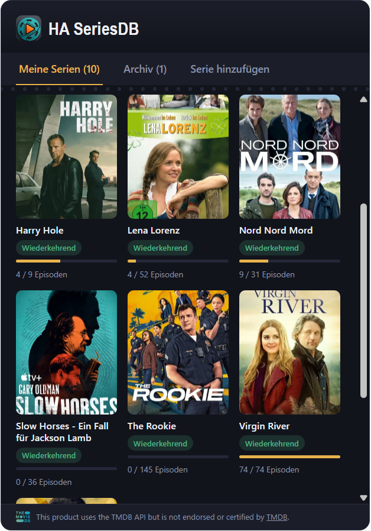

# HA SeriesDB – Home Assistant Custom Integration

<p align="center">
  
</p>

<p align="center">
  <a href="https://github.com/hacs/integration"></a>
  <a href="https://github.com/charly166/ha-seriesdb/releases"></a>
  <a href="https://github.com/charly166/ha-seriesdb/blob/main/LICENSE"></a>
</p>

[English version](README.md)

---

Eine Home-Assistant-Integration inkl. eigener Lovelace-Karte (GUI), mit der du
TV-Serien über die **kostenlose themoviedb.org (TMDB) API** suchen, zu einer
Watchlist hinzufügen und einzelne Episoden als "gesehen" abhaken kannst.

<p align="center">
  
</p>

## Funktionsumfang

- Serien über themoviedb.org suchen und zur Watchlist hinzufügen
- Übersicht "Meine Serien" mit Poster, Sehfortschritt (X / Y Episoden) und
  Serienstatus (Wiederkehrend / Beendet / Abgesetzt / …)
- Detailansicht pro Serie: Staffeln auf-/zuklappbar, jede Episode einzeln
  abhakbar, ganze Staffel mit einem Klick als gesehen markieren. Beim
  Abhaken einer Episode werden automatisch auch alle vorherigen Episoden
  mit markiert. Bereits komplett gesehene Staffeln werden beim Öffnen einer
  Serie automatisch eingeklappt.
- **Archiv**: Serien lassen sich in der Detailansicht archivieren (z.B. wenn
  komplett gesehen und die Serie beendet ist) und wandern dann vom Reiter
  "Meine Serien" in einen eigenen "Archiv"-Reiter
- Kartenbreite **und -höhe** in modernen "Sections"-Dashboards per Ziehen
  anpassbar, füllt dabei exakt die zugewiesene Rasterzelle aus
- Eigenes Icon/Logo in "Einstellungen → Geräte & Dienste" (Home Assistant
  2026.3+)
- Automatischer Nachtrag neuer Episoden alle 12 Stunden über eine
  Home-Assistant-Sensor-Entität pro Serie (z.B. für Automationen wie
  "benachrichtige mich, wenn eine neue Folge verfügbar ist")
- Services für Automationen: `ha_seriesdb.add_series`,
  `remove_series`, `mark_episode_watched`, `mark_episode_unwatched`,
  `mark_watched_up_to`, `mark_season_watched`, `set_archived`, `refresh`
- Alle Daten (Watchlist + Sehstatus + Archiv) werden lokal in Home Assistant
  gespeichert (`.storage/ha_seriesdb_data`) – kein Cloud-Konto nötig,
  außer dem kostenlosen TMDB-API-Key.

## Rechtliches: TMDB-Attribution & Lizenz

Diese Integration nutzt die kostenlose TMDB-API. Deren Nutzungsbedingungen
verlangen einen sichtbaren Pflichthinweis samt Logo. Die Karte zeigt diesen
Hinweis bereits automatisch als kleine Fußzeile an – **du musst nur noch
einmalig das offizielle TMDB-Logo hinterlegen**, da TMDB dessen automatisierte
Weiterverbreitung nicht gestattet:

1. Auf https://www.themoviedb.org/about/logos-attribution eines der
   freigegebenen Logos herunterladen (SVG oder PNG, z.B. die kurze
   quadratische Variante).
2. Die Datei unverändert (Farbe/Seitenverhältnis nicht anpassen) als
   `tmdb-logo.svg` (bzw. `.png`, dann den Dateinamen in
   `custom_components/ha_seriesdb/www/ha-seriesdb-card.js` in der Methode
   `_renderTmdbAttribution()` einmal anpassen) hier ablegen:
   ```
   custom_components/ha_seriesdb/www/tmdb-logo.svg
   ```
3. Fertig – solange die Datei fehlt, blendet die Karte den Logo-Platzhalter
   automatisch aus, zeigt aber weiterhin den Pflicht-Text an.

Der Code selbst steht unter der [MIT-Lizenz](LICENSE) und darf frei
weiterverbreitet, verändert und veröffentlicht werden. Das im Header der
Karte verwendete "HA SeriesDB"-Logo ist dein eigenes, bereitgestelltes
Bildmaterial.

Diese Angaben sind keine Rechtsberatung, sondern eine Zusammenfassung der
zum Erstellungszeitpunkt öffentlich einsehbaren TMDB-Nutzungsbedingungen
(https://www.themoviedb.org/api-terms-of-use). Prüfe vor einer
Veröffentlichung sicherheitshalber selbst die aktuelle Fassung.

## 1. Kostenlosen TMDB API-Key erstellen

1. Kostenloses Konto auf https://www.themoviedb.org anlegen (falls noch
   nicht vorhanden).
2. Unter **Profil → Einstellungen → API** (bzw. direkt
   https://www.themoviedb.org/settings/api) einen API-Key beantragen.
   TMDB fragt dabei den Verwendungszweck ab – für die private Nutzung genügt
   die Option "Developer" / "Privat".
3. Den angezeigten **"API Key (v3 auth)"** kopieren (nicht den "API Read
   Access Token" – dieser wird von der Integration nicht verwendet).

TMDB erlaubt in der kostenlosen Stufe großzügige Limits für private Nutzung
(grob ~40 Anfragen pro 10 Sekunden), das reicht für diese Integration
problemlos.

## 2. Installation in Home Assistant

### Über HACS (empfohlen)

1. In Home Assistant **HACS** öffnen
2. Drei-Punkte-Menü (oben rechts) → **Benutzerdefinierte Repositories**
3. `https://github.com/charly166/ha-seriesdb` als Repository-Typ
   **Integration** hinzufügen
4. In HACS nach **"HA SeriesDB"** suchen und herunterladen
5. Home Assistant neu starten

### Manuell

1. Den Ordner `custom_components/ha_seriesdb` in das
   `custom_components`-Verzeichnis deiner Home-Assistant-Konfiguration kopieren,
   z.B. per Samba/SSH nach:
   ```
   <config>/custom_components/ha_seriesdb/
   ```
2. Home Assistant neu starten.

## 3. Integration einrichten

**Einstellungen → Geräte & Dienste → Integration hinzufügen** → nach
"HA SeriesDB" suchen → den API-Key eingeben.

## 4. Die Karte registriert sich automatisch

Die Karte registriert sich beim Setup selbst als Lovelace-Dashboard-Ressource
– genau so, wie es die manuelle Aktion unter „Einstellungen → Dashboards →
Ressourcen" auch tun würde, indem sie in dieselbe Storage-Collection
schreibt. Für Dashboards im (Standard-)Storage-Modus ist kein manueller
Schritt nötig. Nach der Installation einfach einmal Home Assistant neu
starten und danach den Browser neu laden.

**Nur falls dein Dashboard noch im alten YAML-Modus läuft** (nicht der
Standard), erlaubt Home Assistant Integrationen grundsätzlich keinen
Schreibzugriff auf die Ressourcenliste. In dem Fall in der
`ui-lovelace.yaml` manuell ergänzen:
```yaml
resources:
  - url: /ha_seriesdb/ha-seriesdb-card.js?v=14
    type: module
```
In dem Fall musst du diese Nummer nach jedem künftigen Update selbst
erhöhen – Storage-Modus-Dashboards übernehmen das automatisch. Die exakte,
aktuelle Versionsnummer steht immer im Log (**Einstellungen → System →
Protokolle**, Suche nach „HA SeriesDB").

## 5. Karte zum Dashboard hinzufügen

1. Dashboard bearbeiten → **Karte hinzufügen** → ganz unten **"Manuell"**.
2. Folgendes einfügen:
   ```yaml
   type: custom:ha-seriesdb-card
   ```
3. Speichern. Die Karte zeigt drei Reiter: "Meine Serien", "Archiv" und
   "Serie hinzufügen" (Suche).

Nutzt du eine Dashboard-Ansicht vom Typ **"Sections"** (seit Home Assistant
2024.5 der Standard für neue Dashboards), kannst du sowohl Breite als auch
Höhe der Karte direkt im Dashboard-Editor per Ziehen am Rand/Eck anpassen –
die Karte füllt dabei tatsächlich die zugewiesene Höhe aus, statt nur mit
ihrem Inhalt zu wachsen. Standardmäßig volle Breite, 8 Zeilen hoch,
einstellbar zwischen 6 Spalten/4 Zeilen und voller Breite/16 Zeilen. Bei
älteren "Masonry"-Ansichten ist weder Breite noch Höhe pro Karte individuell
einstellbar (Einschränkung dieses Ansichtstyps, nicht der Karte selbst).

**Falls die Karte trotz breiterem Abschnitt weiterhin nur schmal (1 Spalte)
angezeigt wird:** Home Assistant speichert die Kartengröße pro Karteninstanz
in der Dashboard-Konfiguration (`grid_options`). Wurde die Karte vor diesem
Update hinzugefügt, kann dort noch ein alter, kleiner Wert hinterlegt sein,
der den neuen Standard der Karte überschreibt – das Vergrößern des
*Abschnitts* ändert daran nichts, da die Karte selbst weiterhin fest auf
klein eingestellt bleibt. Zwei Möglichkeiten, das zu beheben:

- **Einfachste Lösung**: Karte aus dem Dashboard entfernen und über die
  Manuelle-Karte-Eingabe wie oben neu hinzufügen – dann greift der neue
  Standardwert der Karte (volle Breite, 6–12 Spalten einstellbar).
- **Ohne Neu-Hinzufügen**: Karte im Dashboard-Editor bearbeiten → oben rechts
  auf die drei Punkte → "Bearbeiten als YAML" → eine eventuell vorhandene
  `grid_options:`-Zeile entfernen (oder auf `columns: 12` setzen) → speichern.

Nach einem Karten-Update reicht normalerweise ein einfacher Reload (F5),
sobald die Ressourcen-URL (siehe oben) auf die neue Versionsnummer
aktualisiert wurde – ein Hard-Reload (Strg+Shift+R) ist in der Regel nicht
nötig, schadet aber auch nicht.

## 6. Bedienung

- **Serie hinzufügen**: Reiter "Serie hinzufügen" → Titel eintippen (ab 2
  Zeichen wird automatisch gesucht) → bei der gewünschten Serie auf
  "Hinzufügen" klicken. Es erscheint kurz eine Bestätigung ("… wurde zur
  Watchlist hinzugefügt"), danach wird das Suchfeld automatisch geleert.
- **Episoden abhaken**: In "Meine Serien" auf ein Poster klicken → in der
  Detailansicht öffnen sich die Staffeln, jede Episode hat eine Checkbox.
  Beim Ankreuzen einer Episode werden automatisch auch alle vorherigen
  Episoden (nach Staffel/Episodennummer) als gesehen markiert – du musst
  also nicht jede Folge einzeln anklicken, sondern nur die zuletzt gesehene.
  Beim Entfernen des Häkchens wird nur diese eine Episode zurückgesetzt.
  Über "Alle gesehen" bzw. "Alle zurücksetzen" lässt sich zusätzlich eine
  komplette Staffel auf einmal markieren. Am Ende der Episodenliste gibt es
  zusätzlich zum Link oben noch einen zweiten "Zurück zur Übersicht"-Link.
- **Serie archivieren**: In der Detailansicht auf "Archivieren" klicken – die
  Serie wandert dann in den Reiter "Archiv" und verschwindet aus "Meine
  Serien". Ist eine Serie komplett gesehen und ihr TMDB-Status "Beendet"
  oder "Abgesetzt", zeigt die Detailansicht dafür einen Hinweis an. Über
  "Aus Archiv zurückholen" lässt sich der Schritt jederzeit rückgängig
  machen.
- **Serie entfernen**: In der Detailansicht unten bei den Serieninfos.

## Automationsbeispiel

```yaml
automation:
  - alias: "Neue Episode verfügbar"
    trigger:
      - platform: state
        entity_id: sensor.game_of_thrones  # entity_id je nach Serie
        attribute: next_unwatched_episode
    condition:
      - condition: template
        value_template: "{{ trigger.to_state.attributes.next_unwatched_episode is not none }}"
    action:
      - service: notify.mobile_app_dein_handy
        data:
          message: >
            Neue Episode von {{ trigger.to_state.name }}:
            {{ trigger.to_state.attributes.next_unwatched_episode }}
```

## Technische Hinweise

- Reine Python-Standardbibliothek + `aiohttp` (in Home Assistant bereits
  enthalten) – es werden keine zusätzlichen Pip-Pakete installiert.
- Die Lovelace-Karte ist ein reines Vanilla-Web-Component ohne Build-Schritt
  und lädt **keine externen Web-Fonts** (bewusste Entscheidung: das
  Nachladen von Google Fonts überträgt sonst bei jedem Kartenaufruf die
  IP-Adresse an Google, was z.B. das LG München I (Urt. v. 20.01.2022,
  Az. 3 O 17493/20) ohne Einwilligung als DSGVO-Verstoß gewertet hat).
  Stattdessen kommen Systemschriften zum Einsatz.
- Authentifizierung erfolgt über den einfachen TMDB "API Key (v3 auth)" als
  Query-Parameter bei jeder Anfrage – anders als bei thetvdb.com ist kein
  separater Login/Token-Refresh nötig.
- Episoden werden pro Staffel einzeln abgerufen
  (`/tv/{id}/season/{n}`), da TMDB Episodenlisten nicht als eine
  Gesamtabfrage über die ganze Serie anbietet.
- Texte/Beschreibungen werden standardmäßig auf Deutsch angefragt
  (`language=de-DE`). Ist für eine Serie keine deutsche Beschreibung
  hinterlegt, liefert TMDB ggf. ein leeres Feld statt eines Fallbacks.
- `iot_class: cloud_polling` – die Integration ruft aktiv themoviedb.org ab,
  standardmäßig alle 12 Stunden für bereits verfolgte Serien, sowie bei jeder
  manuellen Suche/Hinzufügen-Aktion.
- **Eigenes Icon in "Geräte & Dienste"**: Seit Home Assistant 2026.3 können
  Custom-Integrations ihr Icon/Logo direkt lokal mitbringen (Ordner
  `custom_components/ha_seriesdb/brand/` mit `icon.png`, `icon@2x.png`,
  `logo.png`, `logo@2x.png`) – vorher war dafür zwingend ein Pull-Request in
  das separate `home-assistant/brands`-Repository nötig. Das ist hier bereits
  enthalten und erfordert keine weitere Konfiguration. Nutzt du eine ältere
  HA-Version als 2026.3, wird stattdessen ein generisches Platzhalter-Icon
  angezeigt.
- **Wie die automatische Kartenregistrierung funktioniert (dritter
  Versuch, diesmal von Dauer).** Versuch 1 nutzte Home Assistants
  Hilfsfunktion `frontend.add_extra_js_url()`, um die Karte automatisch in
  jedes Dashboard einzubinden. In der Praxis lief das der eigenen
  Kartenerstellung von Home Assistant den Rang ab: War das Skript zu dem
  Zeitpunkt, an dem ein Dashboard `<ha-seriesdb-card>` erzeugen wollte, noch
  nicht fertig geladen, zeigte Home Assistant einen generischen
  "Konfigurationsfehler" an, ohne jede Fehlermeldung im Log, und das
  Verhalten war zwischen Browsern und Cache-Zuständen inkonsistent. Versuch
  2 schrieb stattdessen direkt in dieselbe Storage-Collection, die auch Home
  Assistants eigene **Lovelace-Ressourcenverwaltung** nutzt
  (`hass.data["lovelace"].resources.async_create_item(...)`), wartete dabei
  aber nur passiv darauf, dass `lovelace.resources.loaded` irgendwann `true`
  wird. Das lief in einen echten, offenen Home-Assistant-Kernfehler
  (https://github.com/home-assistant/core/issues/165767): Die
  Ressourcenliste wird nur "lazy" geladen, ausgelöst durch das *Frontend* –
  ohne dass vorher schon ein Browser ein Dashboard geöffnet hat, wird
  `.loaded` nie `true`, wodurch die Registrierung in der Praxis einfach nie
  auslöste. Versuch 3 (aktuell) behebt das, indem `resources.async_load()`
  **aktiv selbst** aufgerufen wird, statt auf das Frontend zu warten (ein
  unbedenklicher, reiner Lesevorgang von der Festplatte) – und behebt dabei
  gleich einen zweiten, unabhängigen Fehler, der erst beim genauen
  Nachschauen auffiel: Der Lovelace-Modus steckt im Attribut
  `lovelace.resource_mode`, nicht `lovelace.mode`, wie ein früherer Entwurf
  annahm – der Zugriff auf den falschen Attributnamen lieferte über
  `getattr(..., default=None)` still und leise immer `None` zurück, statt
  einen Fehler zu werfen, wodurch die Prüfung auf den Storage-Modus jedes
  Mal fehlschlug, ohne dass das je auffiel. Die Registrierungslogik selbst
  wurde mit gemockten Testszenarien überprüft (Neuanlage,
  Versions-Update, bereits aktuell, YAML-Modus, Lovelace noch nicht
  geladen).
- **Kartengröße in "Sections"-Dashboards.** Die Karte implementiert
  `getGridOptions()` (Standard: volle Breite, 8 Zeilen, einstellbar
  zwischen 6–12 Spalten und 4–16 Zeilen) und setzt zusätzlich durchgehend
  `height: 100%` samt Flex-Layout auf dem Host-Element. Weist eine
  Sections-Ansicht der Karte also eine feste Zellenhöhe zu, füllt die Karte
  diese tatsächlich aus (dasselbe Muster wie bei Karten wie
  `dynamic-weather-card` oder `weather-radar-card`), statt nur mit ihrem
  Inhalt zu wachsen oder zu schrumpfen. Außerhalb eines solchen festen
  Rahmens (z.B. ältere Masonry-Ansichten) wird `height: 100%` laut
  CSS-Spezifikation automatisch zu `auto`, die Karte fällt dann auf eine
  inhaltsbasierte, bei einem sinnvollen Maximum gedeckelte Höhe zurück, um
  Sprünge zwischen unterschiedlich vollen Tabs zu vermeiden.
- **Warum der Layout-Größen-Tab einen (trivialen) Konfigurations-Editor
  braucht.** Der Karten-Bearbeiten-Dialog von Home Assistant zeigt seine
  moderne Tab-Leiste (Konfiguration / Sichtbarkeit / Layout) nur für Karten,
  die `getConfigElement()` implementieren. Ohne das fällt Home Assistant auf
  einen reinen YAML-Dialog ganz ohne Tabs zurück – wodurch auch der
  Layout-Größen-Tab verschwindet, obwohl `getGridOptions()` oben davon
  technisch unabhängig funktioniert. Da diese Karte keine einstellbaren
  Optionen hat, liefert `getConfigElement()` einfach ein minimales
  Custom-Element (`ha-seriesdb-card-editor`) zurück, das nur einen kurzen
  Hinweistext anzeigt und sonst nichts tut.
- Getestet wurde die Code-Struktur gegen die öffentliche TMDB-API-Dokumentation
  (https://developer.themoviedb.org/reference/intro/getting-started). Da in
  dieser Umgebung kein Zugriff auf eine laufende Home-Assistant-Instanz oder
  das offene Internet besteht, konnte kein Live-Test gegen einen echten
  Server durchgeführt werden – bitte nach der Installation kurz prüfen, ob
  Suche und Hinzufügen wie erwartet funktionieren, und bei Fehlermeldungen
  zuerst einen Blick ins Home-Assistant-Log
  (`custom_components.ha_seriesdb`) werfen.

## Ordnerstruktur

```
ha-seriesdb/
├── LICENSE                MIT-Lizenz
├── README.md / README.de.md
├── hacs.json               HACS-Metadaten
├── .github/workflows/      HACS- + hassfest-Validierung
├── docs/logo.png           Vollständiges Logo (Icon + Schriftzug) für README/Repo
└── custom_components/ha_seriesdb/
    ├── __init__.py          Setup, Services, Karten-Auslieferung
    ├── api.py                Schlanker themoviedb.org (TMDB) v3 Client
    ├── brand/                 Lokale Icons für "Geräte & Dienste" (HA 2026.3+)
    │   ├── icon.png / icon@2x.png
    │   └── logo.png / logo@2x.png
    ├── config_flow.py        Einrichtungsdialog (API-Key)
    ├── const.py
    ├── coordinator.py        Periodisches Nachladen neuer Episoden
    ├── frontend.py            Automatische Lovelace-Ressourcen-Registrierung
    ├── manifest.json
    ├── sensor.py              Eine Sensor-Entität pro verfolgter Serie
    ├── services.yaml
    ├── store.py               Persistente Watchlist + Sehstatus + Archiv
    ├── strings.json / translations/
    ├── websocket_api.py       WebSocket-Befehle für die Karte
    └── www/
        ├── ha-seriesdb-card.js    Lovelace-Karte (GUI)
        ├── ha-seriesdb-icon.png   App-Icon für die Kartenkopfzeile
        └── tmdb-logo.svg          ⚠️ selbst von TMDB herunterladen, siehe oben
```

## Mindestanforderungen

- Home Assistant **2024.5.0** oder neuer (ältere Versionen funktionieren
  ebenfalls, nur ohne anpassbare Kartenbreite und ohne lokales Icon unter
  "Geräte & Dienste")

## Lizenz

MIT – siehe [LICENSE](LICENSE) für Details.
```
